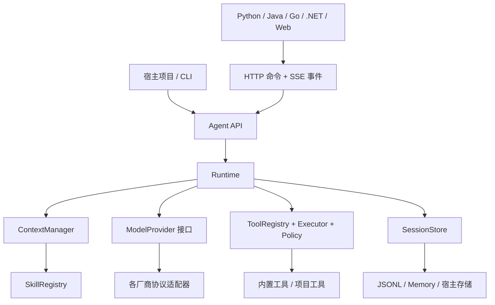

# Coto Agent 基底设计

日期：2026-09-19。

状态：源码调研、实施依据与实现映射。核心代码已在当前功能分支实现并由 `docs/implementation-log.md` 记录验证状态；本文仍保留设计取舍、来源映射和未覆盖范围，不等同于真实 Provider 或跨语言生产验收。

## 1. 目标与建议

交付一个可以被其他项目直接引用、支持自定义模型 Provider、内置基础工具、支持 Skill 和持久会话的 Agent 组件包。宿主项目应通过配置与少量扩展代码改变行为，而无需维护一份 Codex 产品分支。

建议使用 TypeScript 实现核心，最低运行环境拟定为 Node.js 22，同时首版交付可独立启动的 HTTP/SSE 服务。Node.js 服务、脚本和 Electron 主进程可直接 import；Python、Java、Go、.NET 等通过标准协议调用同一内核。核心优先使用标准接口，文件、进程和持久存储集中在 Node 适配层。跨语言接入以服务进程为运行边界，调用方无需改成 TypeScript；服务本身仍需 Node 运行环境。

采用「固定 Codex 源码版本 + 有来源的机制移植 + Provider 协议适配」路线。这个选择意味着 Rust 核心会有 TypeScript 重实现，不能称为原封不动抽出几份 Rust 文件，也不能声称完整继承 Codex 的行为或安全能力。直接移植的算法、规则和测试样例逐项记录来源。

先以一个 npm 包、多个子路径导出交付，暂定包名 `@coto/agent`，发布前检查名称可用性。首版同时提供库入口、CLI 和 `coto serve` 服务入口。流式事件、中途输入、恢复、审批和远程业务 Tool 都是可运行的首版交付。鉴权体系映射、业务数据库、反向代理和各 Web 框架集成由独立开发说明指导接入，见 [后端与多技术栈接入设计](backend-integration.md)。

## 2. 当前源码证据

已下载官方仓库到 `upstream/codex/`，固定 commit：`7498521d288b9b3b96ffba4eedf089d8d6e06a84`。下载方式为浅克隆，包含该版本源码，不包含完整历史。来源记录在根目录 `upstream.lock.json`。

可核对的官方来源：[固定版本](https://github.com/openai/codex/tree/7498521d288b9b3b96ffba4eedf089d8d6e06a84)、[Provider 协议](https://github.com/openai/codex/blob/7498521d288b9b3b96ffba4eedf089d8d6e06a84/codex-rs/model-provider-info/src/lib.rs)、[TS SDK](https://github.com/openai/codex/blob/7498521d288b9b3b96ffba4eedf089d8d6e06a84/sdk/typescript/README.md)、[许可证](https://github.com/openai/codex/blob/7498521d288b9b3b96ffba4eedf089d8d6e06a84/LICENSE)。

官方文档站本次访问返回 403；以下判断依据实际下载的官方 GitHub 源码。已检查相关实现与依赖，未编译或运行上游测试。

| 范围 | 上游实现位置 | 观察与移植方向 |
| --- | --- | --- |
| Runtime | `codex-rs/core/src/session/turn.rs`，`session/step_context.rs` | 每轮循环接收输入、捕获步骤配置、生成请求、处理工具与续轮、检查预算；移植循环和生命周期约束 |
| 中途输入 | `codex-rs/core/src/session/{input_queue,turn_input,turn_suspension}.rs` | 输入队列、活动轮次和中断各有状态；中途输入纳入核心契约 |
| Context | `codex-rs/core/src/context_manager/history.rs`、`normalize.rs`，`core/src/compact.rs` | 模型窗口有独立状态、token 估算、工具调用与结果配对、压缩与上下文重注入；按中立消息类型重实现 |
| Tool | `codex-rs/core/src/tools/{registry,router,parallel,orchestrator,context}.rs` | 工具规格、路由、执行、并发、审批与结果分别处理；复用这些责任边界 |
| Skill | `codex-rs/skills/src/{parser,selection}.rs`，`codex-rs/ext/skills/src/{host_prompt,tools/read}.rs` | frontmatter 元数据、显式选择、按需读取、避免重复注入；移植文件格式及发现/加载语义 |
| Session | `codex-rs/core/src/thread_manager.rs`，`codex-rs/rollout/src/{recorder,writer_lock}.rs` | create/resume/fork、JSONL 记录、刷盘确认、单写者锁；重实现为宿主可替换的存储接口 |
| Provider | `codex-rs/model-provider-info/src/lib.rs`，`codex-rs/model-provider/src/provider.rs` | 自定义地址、认证、重试已存在；配置中的 `WireApi` 仅接受 Responses，`chat` 被明确拒绝；现有 Provider 抽象仍包含 Responses 路由语义 |
| 官方 TS SDK | `sdk/typescript/README.md`、`src/exec.ts` | 启动 Codex CLI，交换 JSONL；它不直接提供可以独立改写的 TS 核心 |
| Patch | `codex-rs/apply-patch/src/parser.rs` | Codex patch 格式是可独立审查的移植候选，后续按原测试语义验证 |

当前 `codex-core` 的 Cargo 清单中有 74 条 `codex-*` workspace 依赖声明，还包含按平台引用的 crate。工具调用对象直接持有 Session 和 TurnContext；Context 使用 Codex 的 ResponseItem 类型。复制一个 `core` 目录不能得到独立、通用的组件库。

### 路线比较

| 路线 | 适合之处 | 对本需求的代价 | 决策 |
| --- | --- | --- | --- |
| 包装 CLI / app-server | 最快使用现有 Codex 行为 | 携带二进制与完整运行环境，深度改工具和模型协议仍需修改内核 | 可用于未来互操作，不作为基底 |
| 裁剪 Rust workspace | 代码直接复用程度高，适合 Rust 消费者 | 依赖裁剪、协议替换、跨平台二进制和语言绑定都会成为维护工作 | 若后续明确优先原生 Rust，再重新决策 |
| TypeScript 机制移植 | 宿主可直接注册 Tool、Provider、Context 与 Store，源码容易修改 | 需要重新证明语义；不会自动获得原版成熟度 | 推荐 |

抽取工作的产物应包含源码映射、移植代码和行为测试；只有接口命名相似、没有对应机制和验证，不算完成抽取。

## 3. 包结构和依赖方向

```text
@coto/agent
  /core        Runtime、消息与事件类型、接口、默认上下文策略
  /providers   Responses、Chat Completions、Anthropic、Gemini 适配器
  /tools       文件、搜索、patch、进程、HTTP 的基础工具
  /skills      发现、索引、选择、加载与资源定位
  /session     Session API、默认 JSONL Store、Memory Store
  /server      HTTP 命令接口、SSE、鉴权钩子、生命周期管理
  /client      基于 fetch 的客户端，浏览器与 Node 共用中立协议
  /testing     脚本化假 Provider、内存 Store、录制回放辅助
  CLI          基础运行、继续会话、列出会话、配置诊断、serve
```

仓库拟使用 `src/{core,providers,tools,skills,session,server,client,testing}`，加 `examples/`、`protocol/` 和 `tests/`，先保持单包。server 和 client 使用独立导出，嵌入 core 无需启动监听端口。协议用 JSON Schema/OpenAPI 描述并与实现一起校验，将来出现真实独立发布需求时再拆包。



`core` 只依赖接口和中立类型，不能导入厂商 SDK、Node 文件/进程实现或业务代码。默认入口负责组合这些实现。厂商依赖通过各自子路径加载，避免导入 core 就加载所有 SDK。

## 4. Runtime：明确的执行状态和停止条件

概念统一：Session 是持久对话；Turn 是一次用户输入驱动的执行；Step 是一次模型请求及其工具调用处理。不要用同一个 session ID 同时指代会话、模型连接和 Shell 进程。

主要流程：接收输入并持久化 → 捕获本步配置与工具快照 → 构建预算内上下文 → 请求模型 → 接收完整工具调用 → 校验参数及权限 → 执行 → 持久化结果 → 继续请求，直到模型完成或达到停止条件。

Session 有 idle/active/archived 等聚合状态；Turn 有 queued/running/waiting_approval/interrupting/interrupted/completed/failed 等执行状态。状态变化输出结构化事件；文本、工具进度、usage 和压缩事件也通过同一事件接口交给宿主，core 不打印控制台或自行弹窗。

关键约束：

- 同一 Session 同时只运行一个 Turn；额外输入支持 steer、follow_up 和 interrupt 三种明确语义。不同 Session 可以并行。
- 每步固定 Provider、模型参数、工具清单、Skill 版本和权限快照。正在执行的工具使用当时宣告的定义，热更新从后续步骤生效。
- 首版仅在一个模型响应完整结束、工具参数组装并验证后执行其工具调用。流式增量可以展示，但不能提前触发不完整调用。这是为简化恢复做出的明确取舍。
- 设定 `maxSteps`、总时间、工具时间、累计 token 预算和有限重试次数，达到上限有可辨认的结束原因；连续无进展也能终止。
- 只读且声明可并行的工具使用有上限的并发，写入和未知副作用默认串行。同一批结果以稳定顺序回填。
- AbortSignal 向模型传输与工具传播；内置进程工具负责终止进程树。自定义工具必须声明并实现取消能力，无法确认停止时记录未知状态。
- 认证、参数错误不做盲目重试；超时、429、暂时性故障采用有限退避。已展示的失败流标记 attempt 失效，避免将两次响应拼接成一个答案。
- 已执行工具不会因重新请求模型而自动重跑。核心不承诺外部副作用的 exactly-once。

外部事件包含 sessionId、eventId、schemaVersion 和会话内递增 seq；关联执行时再包含 turnId、stepId、attemptId、messageId 或 toolCallId。观察者异常不能改变工具结果；需要阻断执行的逻辑必须注册到明确的 Policy 接口。

### 中途插入消息是一等能力

统一入口 `session.submitInput({ inputId, mode, content, expectedTurnId })`，由核心持久化输入并处理顺序，HTTP 服务只映射该接口。

| mode | 行为 | 适用场景 |
| --- | --- | --- |
| `steer` | 为当前 Turn 加入补充消息，在下一个模型请求构建前应用 | 「输出改成中文」「补充这个文件」「只处理 A 模块」 |
| `follow_up` | 排队为下一 Turn，当前 Turn 正常完成后启动 | 「这个做完，再检查测试」 |
| `interrupt` | 持久化新输入、取消当前请求及可取消工具，确认收尾后以新 Turn 处理新指令 | 「停下，先做另一个方案」 |

普通输入默认 follow_up：空闲时立即开始，繁忙时进入队列。steer/interrupt 必须携带 expectedTurnId；目标轮次已结束或被替换时返回冲突，调用方可显式改为 follow_up。禁止把本应插入旧任务的消息静默应用到新任务。

接受输入返回 `inputId + acceptedSeq + 状态`，随后输出 `input.accepted`、`input.applied` 或 `input.rejected`。accepted 只代表可靠保存，applied 才代表已纳入指定模型请求；模型是否遵循补充要求仍由实际结果判断。输入在请求失败时保持原身份并重用于重试，不重复追加用户消息。

这里的 durable accepted 是本组件新增的服务契约。当前上游 `session/turn_input.rs` 明确说明其提交回执不等待 rollout 持久化；移植时需要为本组件补上持久化屏障和崩溃恢复测试，不能把该保证归因于直接复用上游代码。

steer 不修改已经发出的模型请求，不半途拼接正在传输的 JSON。若当前模型响应已结束但有待应用 steer，必须先检查队列再宣告 Turn 完成，防止边界竞态丢消息。等待审批或执行长工具时 steer 会保留 pending 状态；需要立即停止的调用方使用 interrupt。模型正在压缩时保留新输入，在摘要提交后、下一模型请求前纳入。

当前工具已开始时，interrupt 不回滚其外部影响；先取消可取消工作，未开始的调用标记取消，已完成结果记录，未知副作用进入恢复决策。旧工具仍在写入或状态未知时，不让新的写操作与其竞争。旧审批失效，迟到结果按原调用归档，不注入新 Turn。

旧 Turn 中尚未应用的 steer 在明确中断时输出 `input.rejected`，原因 `target_turn_interrupted`，原输入内容仍保留；不静默转移给新任务。已排队 follow_up 继续保留并暂停自动消费，interrupt 创建的新轮次优先；待其正常完成后按原顺序消费。恢复失败的旧轮次时，对已接受输入逐项记录沿用或拒绝的决策，防止 pending 永远悬空。

输入顺序、轮次完成和取消命令由同一 Session 调度器串行决定；inputId 防止网络重试重复执行。队列有数量、字节上限并支持查询/撤回尚未应用的输入；撤回已应用输入返回冲突。应用重启后恢复已接受的输入，活动 Turn 先进入中断/恢复检查。follow_up 默认仅在前一轮正常完成后自动启动；失败、中断、待审批或恢复决策时保持待处理，交由明确 resume/interrupt 指令推进。

## 5. Provider：协议、模型能力和凭据分别配置

「任意 Provider」定义为：已实现协议的服务可配置接入；新协议可实现一个 adapter 接入；不表示任何 URL 或任何模型都会自动获得工具调用、图片、推理等能力。

首版完成四种协议适配：OpenAI Responses、OpenAI Chat Completions、Anthropic Messages、Gemini generateContent/streamGenerateContent。先用 Responses 和 Anthropic 做纵向闭环，以两个明显不同的协议验证抽象，再补齐另两个。兼容网关与本地模型按真实协议和能力配置；不能只凭厂商名字宣称兼容。

每个 Provider 配置包括 protocol、baseURL、认证引用、header/query 配置、模型名、超时和重试；模型能力包括 contextWindow、maxOutputTokens、工具调用、并行调用、图片输入、结构化输出与推理参数支持情况。允许显式覆盖能力，启动时进行静态校验，联网探测由调用者主动触发。

中立消息保存角色、文本/图片等 content parts、工具调用 ID、工具结果及状态。模型和厂商专属信息放到有类型、有来源的扩展字段；不能把所有内容压成一个字符串，也不能把某家原始响应作为核心消息结构。

拟定核心接口：

```typescript
interface ModelProvider {
  capabilities(model: string): ModelCapabilities;
  stream(request: ModelRequest, options: { signal: AbortSignal }): AsyncIterable<ModelEvent>;
}
```

`ModelEvent` 归一化文本增量、工具参数增量、完整调用、usage、终止原因和错误。schema 编译与校验、消息角色映射、错误映射、SSE 分块解析、reasoning/thinking 字段与签名恢复由 adapter 完成。优先使用厂商 SDK 或成熟协议解析库，核对当前版本和许可证后锁定依赖。

跨 Provider 切换只在无活动 Turn 且无悬而未决工具调用时执行。重新构建请求并重新计算窗口预算，保留用户/助手可见内容和工具事实；opaque reasoning、签名、response ID、缓存句柄与远程压缩产物仅在同一兼容作用域内复用。无法表示的内容需要明确报错或经宿主选择转换，不能静默丢弃。首版关闭自动跨厂商 failover。

模型 usage 缺失时记录 unknown；预算使用保守估算，估算值与供应商计量分开。价格只有显式配置并有适用版本时才计算。

凭据由环境变量或宿主 SecretResolver 提供。配置诊断、Session 记录和错误日志不保存解析后的密钥。CLI 只自动读取声明式项目配置，不自动执行从仓库发现的 JS 配置文件。

## 6. Context：持久历史和模型窗口各司其职

Session Store 保存可恢复的历史与执行事实；ContextManager 从这些记录生成本次模型输入。压缩改变模型窗口，原始会话记录继续保留。

上下文由以下部分组成：宿主指令和权限约束、项目规则、当前目标/用户输入、已启用 Skill、历史摘要、最近完整消息与工具结果。每部分携带来源、版本、优先级和预算。工具输出与检索文本作为资料，不升级为宿主指令。

默认预算：`可用输入 = 模型窗口 - 输出预留 - 安全余量`。计算包含工具 schema、Skill 描述、图片成本和协议开销。Provider 支持精确计数时使用精确计数，否则使用可替换的保守估算并标注；不能把字符数固定除以四当作所有语言和模型的精确结果。

先限制单次工具输出并将完整内容保存成 artifact，再在预算阈值前压缩较早的完整回合。压缩使用当前 Provider 的普通生成能力，不依赖 Codex 专属 compact endpoint；压缩请求禁用工具并受独立预算、超时和重试约束。

摘要至少保留用户目标、有效约束、已确认事实、文件/产物引用、未完成工作；最近回合与工具 call/result 作为完整组保留。摘要不能授予权限，宿主授权记录单独保留。固定指令、最新用户输入和未解决调用不静默截断。

只有摘要成功、满足预算且校验通过后才提交新窗口 checkpoint；压缩失败保留原窗口。输入已超长时按完整组分块归纳，若固定内容本身已经装不下则返回明确错误，禁止无限压缩重试。

项目通过 ContextContributor 增加检索、数据库记录或业务上下文，通过 CompactionStrategy 替换压缩策略。长期向量记忆不是首版完成条件。

## 7. Tool 与 Skill

### Tool：可执行能力

`defineTool` 接收稳定名称、description、JSON Schema、execute、effect 和可选并发/取消声明。参数经过真正的 schema validator 校验后才能进入 executor；名称冲突启动时报错。工具结果包含 success/error、模型可见内容、artifact 引用和必要元数据。

调度流程为名称解析 → 参数校验 → Policy 判断 → 必要审批 → 执行 → 输出限制与记录。权限依据具体参数、工作目录和目标，不只依据工具名称；批准绑定调用参数及策略版本，参数变化须重新判断。

内置工具范围：

| 工具 | 首版行为 |
| --- | --- |
| `read_file`、`list_files` | 范围/分页读取、二进制检测、大小限制、工作区路径校验 |
| `search_files` | 有界全文搜索与 glob 过滤，默认尊重 ignore；优先 rg，缺失时使用有界文件扫描 |
| `write_file`、`edit_file` | 原子写入；编辑要求旧内容唯一匹配或版本哈希一致，避免覆盖并发更改 |
| `apply_patch` | 移植经验证的 patch 解析/应用语义，处理新增、修改和删除；多文件预检，失败报告已应用项，不宣称跨文件事务原子性 |
| `exec_command`、`process_read`、`process_cancel` | 明确 cwd/env、超时、输出限额；长任务返回进程句柄并可继续读取/取消 |
| `http_fetch` | 限定协议、目标、跳转、响应大小和超时，默认只读请求；宿主可配置内网访问规则 |
| `skills_list`、`skills_read` | 读取可用 Skill 的目录、正文及其资源 |

工具可以按项目裁减；纯对话模式可以不装载本地执行工具。首版支持文本和图片引用的内容结构，但不内置商业图像生成、浏览器自动化或搜索引擎服务。

默认策略允许工作区范围读取；写入、Shell 和网络根据显式预设或宿主 Policy 决定 allow/deny/ask。无交互环境遇到 ask 返回结构化待审批状态，不能挂起等待一个不存在的终端输入。恢复审批时校验具体调用、当前策略和工作区。

文件工具应处理路径穿越、软链接及目标变化。但路径校验和命令 allowlist 无法把本机 Shell 变成操作系统沙箱。首版 LocalExecutor 明确用于可信本地环境；需要执行不可信项目代码时必须注入具有隔离能力的 executor。沙箱缺席不能伪称已有隔离保证，Shell 子进程仅继承宿主明确提供的环境。

### Skill：指导模型使用能力的可加载资源

兼容常见 `SKILL.md` YAML frontmatter、正文、`references/`、`scripts/` 和 `assets/`。优先解析必需的 name/description，允许附加元数据；使用 YAML parser，避免正则硬拆完整 YAML。

宿主显式指定搜索根，默认可发现项目 `.agents/skills/`；用户全局根只有配置后才加入。基础指令只放受预算限制的名称/描述目录，正文在显式指定、宿主选择或模型调用 `skills_read` 后载入，引用资源继续按需加载。显式缺失的 Skill 返回错误，不能假装加载成功。

多个根中的同名 Skill 使用带来源的稳定 ID，只有唯一时允许短名；覆盖规则明确配置。目录过大时分页或筛选，避免所有 Skill 正文堆进上下文。

Skill 缓存以内容哈希标记并记录到会话；加载时可保留内容快照，恢复时能说明与磁盘版本的差异。读取 Skill 不会自动执行脚本，脚本通过相同 Tool/Policy 路径执行，不增加权限。

项目规则 `AGENTS.md` 由单独的 InstructionLoader 处理，支持工作区根和访问目录的作用范围，限制扫描范围并记录来源。项目文本无法覆盖宿主的权限策略。MCP 作为后续工具来源 adapter 接到同一个 registry；完整插件市场不在首版范围。

## 8. Session：保存、恢复、分叉

对外提供 create、resume、list、get、fork、archive。会话含 sessionId、宿主 workspaceId、工作目录、创建时间、配置摘要和 schemaVersion；数据根由宿主配置，默认项目内 `.coto/`，集成示例会忽略其版本控制。

默认 JSONL Store 加本地 artifact 目录，Memory Store 用于测试。JSONL 是权威历史；索引或快照均可重建。首版文件 Store 适用于本机文件系统，分布式多实例/网络文件系统交给替换的数据库 Store。先定义 append/read/lock/checkpoint 的必要契约，不构建通用 ORM。

关键事件串行追加；在输入接受、模型响应提交、工具开始和结果提交、压缩提交以及 Turn 完成的边界确认持久写入。面向 SSE 的文本增量可按短时间/大小阈值合并，合并后的公共事件持久化后再发出，以支持按 seq 重放；模型上下文仍只使用明确提交的消息。写盘失败立即作为执行故障处理；未持久化 tool.started 不能启动副作用，不能向宿主报告 durable completed。

默认 Store 使用跨进程单写者机制与所有权检查，采用经过验证的本地锁实现，不仅用进程内 Map。快照使用临时文件和原子替换。恢复时只容忍未完成的文件尾记录；中段损坏和未知 schemaVersion 明确失败，不静默丢弃。

恢复重建会话和上下文，不重新执行历史：

- 已有 committed 工具结果直接复用。
- `tool.started` 存在但无结果时，标记副作用结果未知，向宿主返回恢复决策；只有可证明幂等或具有外部幂等键的工具才可按策略重试。
- 未完成模型流标记为中断，从最后已提交步骤重新开始。
- 进程内句柄跨应用重启默认失效，不伪造仍可控制原进程；进程宿主另有持久管理能力时再扩展。
- Session 配置只保存可序列化描述和凭据引用。恢复时宿主重新注册工具/Provider/策略，并检查定义版本；函数和凭据不从 JSONL 反序列化执行。

fork 从已完成 Turn 的边界创建独立历史快照，带来源 ID；复用必要 artifact，不修改父会话。fork 只复制会话状态，不复制或回滚真实工作区；同一工作目录上的并行写入由宿主隔离或串行调度。

## 9. 项目接入和改造方式

以下示例对应当前包 API；包尚未发布到公共 npm registry，需从源码或 tarball 安装：

```typescript
import { createAgent } from '@coto/agent';

const agent = createAgent({
  workspace: process.cwd(),
  provider: {
    protocol: 'openai-chat',
    baseURL: process.env.MODEL_BASE_URL,
    apiKeyEnv: 'MODEL_API_KEY',
    model: process.env.MODEL_NAME,
  },
  tools: 'local-basic',
  skills: { roots: ['./.agents/skills'] },
  policy: 'read-only',
});

const session = await agent.sessions.create();
const result = await session.run('梳理这个项目的结构');
console.log(result.text);

for await (const event of session.runStream('继续分析入口和依赖')) {
  render(event);
}

await agent.close();
```

`run`、`runStream` 是 submitInput 与等待/订阅事件的便捷组合，共享同一调度器。底层提供输入回执、事件订阅和 `cancel(turnId)`，允许另一协程随时插入消息。停止读取事件只取消订阅；需要取消执行必须明确调用 cancel，避免丢弃迭代器就误杀任务。`agent.close()` 有界停止执行并持久化状态，行为与仅断开订阅不同。

缺少模型名、服务地址或必要凭据时，启动校验一次列明缺失字段。官方 Provider 可以有已知默认地址；不内置硬编码的未来模型名。无需凭据的本地服务允许显式关闭认证。

宿主常见改造只触及一个边界：新增业务操作注册 Tool；新增工作方法增加 Skill；新增模型协议实现 ModelProvider；接入数据库替换 SessionStore；增加 RAG 注册 ContextContributor；接入 UI 消费事件并处理审批。向宿主暴露的对象不允许直接随意修改运行中的内部状态。

首版消费示例包括 TS 嵌入、自定义业务 Tool + Skill、CLI 持久会话，以及 Python 和 Java HTTP/SSE 接入。Go/.NET 提供协议映射说明，只有实际运行通过的客户端才能标记验证通过。远程业务 Tool adapter 让 Python/Java 等实现的业务能力注册进同一 Agent，遵循相同 schema、Policy、取消和幂等规则。

项目与项目之间通过各自 workspace/data root 和宿主身份上下文隔离。服务由受控工作区注册表把 workspaceId 解析为文件路径，普通 API 不接收任意服务器本地路径；账号体系通过认证/授权钩子接入，单机 JSONL 示例不宣称是分布式多租户平台。

## 10. 实施顺序与验收

| 阶段 | 交付 | 通过标准 |
| --- | --- | --- |
| M0：来源与设计 | 固定上游源码、映射和本方案 | commit、许可证、相关实现和推荐路线可核对 |
| M1：运行闭环 | 中立协议、Runtime、输入队列、Memory Store、Responses + Anthropic adapter、自定义 Tool | 同一场景经两个不同协议完成「输入 → 工具 → 回填 → 答案」；steer/follow_up/interrupt、中断、重试、step 上限都有确定状态 |
| M2：基础工具与 Policy | 文件/搜索/patch/进程/HTTP 工具、审批接口 | 临时工作区完成真实读写和子进程任务；路径边界、超时、输出限制与拒绝审批生效；中途取消有明确结果 |
| M3：持久化与上下文 | JSONL Store、恢复/fork、预算与压缩 | 进程重启后继续任务；强制崩溃后不重放未知副作用；压缩后目标、约束和工具配对保留；小窗口和超大输出不会形成无限循环 |
| M4：可扩展能力 | Skill、项目规则、Chat Completions + Gemini adapter、Provider 切换 | 显式 Skill 和按需加载可观察；脚本受同一策略控制；切换后消息/调用合法且 token 预算重算；失败能力明确报错 |
| M5：后端与多技术栈 | HTTP/SSE 服务、远程业务 Tool、TS 客户端、协议 schema 和接入说明 | Python/Java 真实消费流事件、插入消息、取消和断线重连；重放不重复执行业务；未授权不能读取会话或执行工具 |
| M6：可分发组件 | exports、类型、CLI/serve、使用示例、来源与许可说明、npm tarball | 干净临时消费项目安装 tarball 后运行；库模式无需服务进程，跨语言模式可独立启动服务；无需全局 Codex 或 Rust 工程；列明端点和各技术栈实测状态 |

每种协议都使用本地 HTTP mock 验证真实序列化、流分片解析、错误和工具往返；仅 mock 中立 ModelProvider 不足以证明 adapter 正确。测试包括分片工具 JSON、连接中断、缺失 usage、工具失败、只读并发与写入串行、能力不支持等具体场景。

从上游测试提炼可迁移的行为用例，保留出处；跨语言移植后不宣称直接通过上游 Rust 全套测试。测试规模集中在公共契约与恢复边界，不机械复制上游产品的所有特性和测试。

真实 Provider 的工具闭环、流式取消、较长上下文与恢复要单列接入验收。使用宿主明确提供的测试配置和有效授权进行低成本调用；缺少凭据时标记「协议 mock 已通过、真实端点未验证」。不将 mock 通过等同所有兼容网关实测可用，也不因缺少某家凭据阻止其他模块交付。

实施开始后建立项目 Git 仓库并使用功能分支；上游目录仅作为参照，不随 npm 包分发。具备远端后以中文 PR/MR 提交本需求范围，合并和发布按实际授权进行。npm 包生成和消费者安装验收可在本地完成，不需要提前发布到公共 registry。

## 11. 许可、维护和已知边界

官方仓库根许可证为 Apache-2.0，存在 NOTICE。直接移植/改写的代码与测试记录上游 commit、原路径及修改说明，分发时保留适用版权、许可证和 NOTICE。示例 Skill、嵌入资产和第三方代码逐项看其独立许可证，不能假设根许可证涵盖一切。产品命名使用 Coto，不暗示是官方 Codex 发行版。

上游更新按指定 commit 审查需要的机制和修复，经过自身契约测试后纳入；不自动跟随 main，不把整份上游源码成为运行时依赖。第 2 节记录上游来源，下面的实现映射说明本版采用方式。

需要保留的工程现实：不同模型的工具调用与长任务质量会不同；摘要可能丢失细节；本地权限策略不等同 OS 沙箱；外部副作用不具备通用 exactly-once；TS 重实现需要自己的恢复与兼容性验证。

首版范围不包含多 Agent 调度、商业插件市场、ChatGPT 登录集成、云端任务平台、长期记忆系统和完整桌面 UI。这些能力后续通过本设计中的 Provider、Tool、Context 或宿主层扩展，不能成为基础包安装运行的前提。

## 12. 0.1.0 实现映射

前文是设计依据；当前公开 API 以 `src/core/types.ts`、README 和 `protocol/` 为准。COTO 参考固定 Codex 版本的责任划分与行为约束，独立实现 TypeScript 内核。本版没有分发或逐行翻译 Codex Rust 源码；Pi AI 是保留其 MIT 许可的协议依赖。

| 范围 | 当前实现 | 验证与扩展边界 |
| --- | --- | --- |
| Runtime / 中途消息 | `src/core/session.ts` | 模型与工具循环、有限重试、步骤/时间限制、审批、取消、steer/follow_up/interrupt；回归测试覆盖撤回和结束边界竞态。时间上限通过 AbortSignal 传播，自定义 Provider、Tool、Policy 和 contributor 必须配合取消 |
| Context | `src/core/context.ts` | UTF-8 字节保守估算或宿主 `estimate`、contributor、近期完整组保留、分批摘要；没有累计 token/价格预算、无进展检测或独立 CompactionStrategy 插件，摘要失败会保留旧窗口并结束该轮 |
| Tool / Skill | `src/tools/`、`src/skills/` | JSON Schema、Policy、基础文件/进程/HTTP、Remote Tool、Skill catalog 和资源读取；注册内容在 Agent 创建时确定，没有运行中热更新接口，项目指令默认只读根目录 AGENTS.md |
| Patch | `src/tools/files.ts` | 使用 MIT `diff` 库的标准 unified diff，未移植 Codex 自定义 patch parser；多文件写入返回已应用路径，不承诺跨文件事务 |
| Session | `src/session/`、`src/core/session.ts` | JSONL/fsync、单写者、尾记录修复、未知副作用核对、恢复/fork/archive；单机持久化，上层数据库可实现 SessionStore，尚无日志裁剪或分布式租约 |
| Provider | `src/providers/` | Pi AI 负责四协议；COTO 提供直接 endpoint、认证、catalog、中立消息和历史指纹隔离。支持文本、图片输入和工具，推理签名保留在同作用域的 opaque 历史中；无通用音频/视频、结构化输出或跨厂商自动 failover |
| 后端与消费端 | `src/server/`、`src/client/`、`src/cli.ts` | HTTP/SSE、owner 钩子、回放和取消；CLI 当前只提供 serve，单服务只公开 default workspace/profile。Python 有实际本地服务 smoke，Java/Go/.NET 是接入说明 |

`tests/` 是 COTO 自身的契约与真实本地 I/O 测试，没有声称通过上游 Rust 测试。四种 Provider 使用本地 HTTP/SSE 协议 fixture；生产 endpoint、真实反向代理和业务鉴权仍需在宿主环境按接入文档验收。
